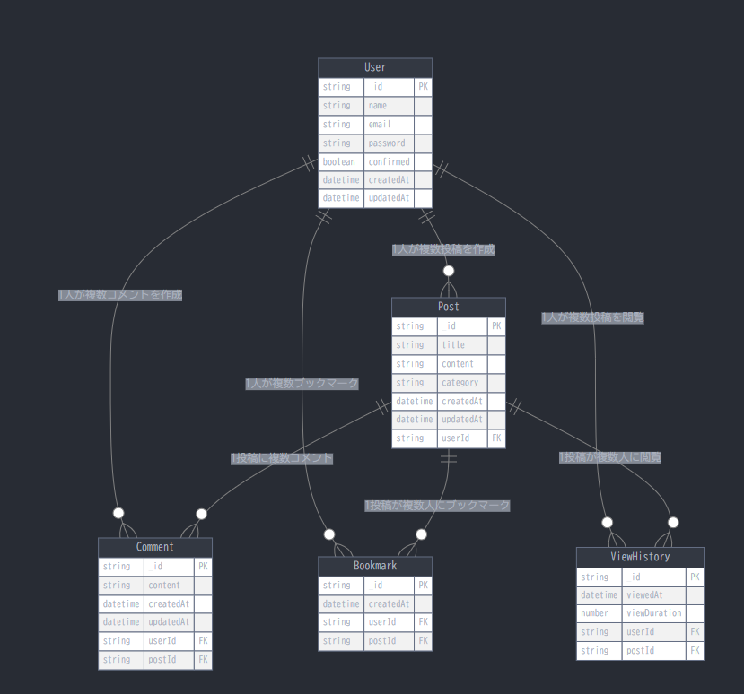

# リフレーミング支援アプリ「見守り」

> もやもやした気持ちをAIと一緒にリフレーミング（考え方を変える）して、心を軽くするためのアプリ
TODO: イメージスクショ貼る



    

## 🌸 アプリのコンセプト

「見守り」は、単なるメンタルヘルスツールではなく、ユーザーの心の成長を大切に見守る温かいコミュニティを目指したアプリです。就労移行支援で学んだリフレーミングの手法をAIプロンプトに組み込み、実用的なアドバイスを提供します。<br>
**(プロンプトはnoteの投稿記事参照!)**

**デザインテーマ**: ピンクと淡いベージュをベースとした、安心感と温かみを重視したUI

## ✨ 主な機能

### 📝 投稿機能
- **リフレーミング前**: もやもやした気持ちを自由に入力
- **AI提案**: 就労移行支援の知見を活かしたプロンプトで、AIが複数のリフレーミング案を提案
- **ユーザーのリフレーミング**: ユーザー自身が考えたリフレーミングも、リフレーミング後の追加投稿可能

### 🔒 編集ポリシー
- **編集不可**: リフレーミング前の気持ち、AIの提案、ユーザーのリフレーミング後の考えは全て編集不可
- **理由**: ありのままの気持ちと、その時頑張って考えた内容を大切にするため

### 💬 コメント機能
- **自分の投稿のみ**: 自分が投稿したものにだけコメント可能(cashtrackerのmiddlewareのhasAccessと同じ要領)
- **用途**: 時間が経って新しい気づきやリフレーミングが生まれた時に追加
- **価値**: 思考の変化や成長過程を時系列で記録

### 👁️ 評価・保存システム
- **「見守った数」のみ表示**: 投稿の閲覧数を「見守られた数」として表示する
- **ブックマーク機能**: 後で見返したい投稿を個人的に保存（数は非表示）
- **理由**: 競争や比較を避け、共感と支え合いの文化を作るため

## 🎯 特徴的な価値

1. **素直な感情を大切にする**: 編集機能を制限することで、その瞬間の本当の気持ちを保護
2. **成長過程の可視化**: コメント機能により、時間をかけた心の変化を記録
3. **専門知識の活用**: 就労移行支援で学んだリフレーミング技法をAIに組み込み
4. **温かいコミュニティ**: 「見守る」という表現で支え合いの文化を醸成
5. **個人的な学習支援**: ブックマーク機能で参考になった投稿を個人的に保存可能
6. **シンプルな操作**: 機能を絞ることで、悩んでいる時でも使いやすい設計

## 🚀 デプロイ済みアプリケーション

- **フロントエンド**: [https://blog-mern-app-front-web.onrender.com/posts](https://blog-mern-app-front-web.onrender.com/posts)
- **バックエンドAPI**: [https://blog-mern-app-1lw2.onrender.com/posts/](https://blog-mern-app-1lw2.onrender.com/posts/)

## 🛠️ 技術スタック

### フロントエンド
- **React** 18.2.0 - UIライブラリ
- **Next.js** 15.2.0 - Reactフレームワーク
- **TypeScript** 5.3.3 - 型安全性
- **Material UI** 6.4.5 - UIコンポーネントライブラリ
- **Redux Toolkit** 2.5.1 - 状態管理
- **React Hook Form** 7.54.2 - フォーム管理
- **SWR** 2.3.2 - データフェッチング
- **Zod** 3.24.2 - バリデーション

### バックエンド
- **Node.js** 22.12.0 - サーバーサイドランタイム
- **Express** 4.x - Webアプリケーションフレームワーク
- **MongoDB** 8.11.0 - NoSQLデータベース
- **TypeScript** 5.x - 型安全性

### インフラ・ツール
- **Docker** 20.10 - コンテナ化
- **GitHub Actions** - CI/CD
- **Render** - デプロイメントプラットフォーム

## 📁 プロジェクト構成

```
/BLOG-MERN-APP
├── /frontend                 # Next.jsフロントエンド
│   ├── /app                  # App Routerディレクトリ
│   │   ├── /auth            # 認証関連ページ
│   │   └── /posts           # 投稿関連ページ
│   ├── /components          # 再利用可能コンポーネント
│   │   ├── /ui              # 基本UI要素
│   │   ├── /layouts         # レイアウト関連
│   │   └── /forms           # フォーム関連
│   ├── /features            # 機能別モジュール
│   │   ├── /auth            # 認証機能
│   │   └── /post            # 投稿機能
│   └── /types               # 型定義
├── /backend                 # Express.jsバックエンド
│   ├── /src
│   │   ├── /controllers     # コントローラー
│   │   ├── /models          # データモデル
│   │   ├── /routes          # APIルート
│   │   └── /middleware      # ミドルウェア
└── /docker                  # Docker設定
```

## 🚀 セットアップ方法

### 必要な環境
- Node.js 16以上
- Docker & Docker Compose
- MongoDB（またはMongoDB Atlas）

### ローカル開発環境の構築

1. **リポジトリのクローン**
   ```bash
   git clone https://github.com/yoshihama-nineball/BLOG-MERN-APP.git
   cd BLOG-MERN-APP
   ```

2. **フロントエンドのセットアップ**
   ```bash
   cd frontend
   yarn install
   cp .env.local.example .env.local  # 環境変数ファイルの作成
   yarn dev
   ```

3. **バックエンドのセットアップ**
   ```bash
   cd backend
   yarn install
   cp .env.example .env  # 環境変数ファイルの作成
   yarn dev
   ```

4. **Docker Composeを使用する場合**
   ```bash
   docker compose up --build
   ```

## 🌐 アクセス情報

- **フロントエンド**: http://localhost:3000
- **バックエンドAPI**: http://localhost:5000

## ⚙️ 環境変数

### フロントエンド (.env.local)
```env
NEXT_PUBLIC_BASE_URL=http://localhost:5000/api/v1/posts
```

### バックエンド (.env)
```env
PORT=5000
MONGODB_URI=mongodb://localhost:27017/blog-app
JWT_SECRET=your_secret_key
NODE_ENV=development
```

## 💻 開発用コマンド

### フロントエンド
```bash
yarn dev     # 開発サーバー起動
yarn build   # プロダクションビルド
yarn start   # プロダクションサーバー起動
yarn test    # テスト実行
yarn lint    # リント実行
```

### バックエンド
```bash
yarn dev     # 開発サーバー起動
yarn build   # TypeScriptコンパイル
yarn start   # プロダクションサーバー起動
yarn test    # テスト実行
```

## 🔧 トラブルシューティング

### MongoDB接続エラー
- MongoDB Atlasを使用する場合、IPアドレスがアクセス許可リストに追加されているか確認
- クラウドサービスからは `0.0.0.0/0` を許可リストに追加

### ポート使用中エラー
```bash
# ポート使用状況確認
sudo lsof -i :5000  # Linux/Mac
netstat -ano | findstr :5000  # Windows
```

### Docker関連エラー
- 環境変数ファイル（.env）が作成されているか確認
- Docker Desktopが起動していることを確認

## 📝 今後の開発予定

- [ ] AI提案機能の実装
- [ ] リアルタイム通知機能
- [ ] モバイルアプリ版の開発
- [ ] 多言語対応
- [ ] アクセシビリティの向上

## 📄 ライセンス

MIT License - 詳細は [LICENSE](LICENSE) ファイルをご覧ください。

## 🤝 コントリビューション

プルリクエストやイシューの投稿を歓迎します。開発に参加される場合は、まずイシューで議論してからプルリクエストを作成してください。

---

**「見守り」** - あなたの心の成長を、温かく見守ります 💖